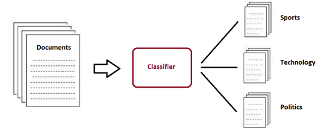

## PROJECT 1 – Document Classification

Document classification is the process of **assigning** categories to documents to make them easier to search, sort, analyze, and filter. It helps organizations like news sites, blogs, and businesses manage large amounts of content. 
In machine learning (ML), document classification is an application within **natural language processing** (NLP), utilizing supervised and unsupervised learning methods. Supervised methods involve training a model on a labeled dataset where documents are tagged with predefined categories. The trained model can then predict the category of new documents, often providing a confidence score for its predictions. __Keywords or frequent words related to specific topics__ (like "goal" for football or "president" for politics) __are used as features to aid in classification__. 

The goal of the project is to develop a program to **classify** documents from a news dataset, which includes documents in various categories (e.g., business, medical, space, sports, politics) and a file listing keywords for each category.

